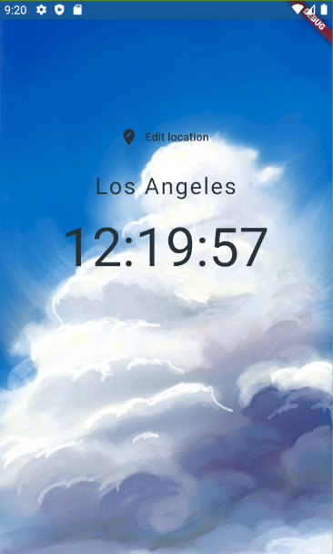
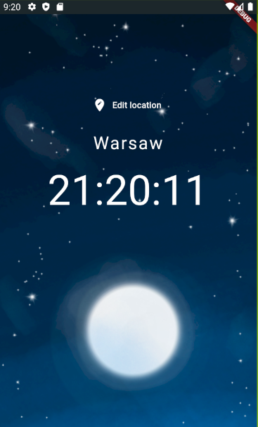

# flutter_time

Project to test Flutter and Dart. Simple world time watch. Inspired by tutorial: https://www.youtube.com/watch?v=1ukSR1GRtMU&list=PL4cUxeGkcC9jLYyp2Aoh6hcWuxFDX6PBJ

## How does it work

The app is basically a clock for 3 different cities in the world - Warsaw, London and Los Angeles. They can be chosen on a separate screen.

## How does it look

    
    

